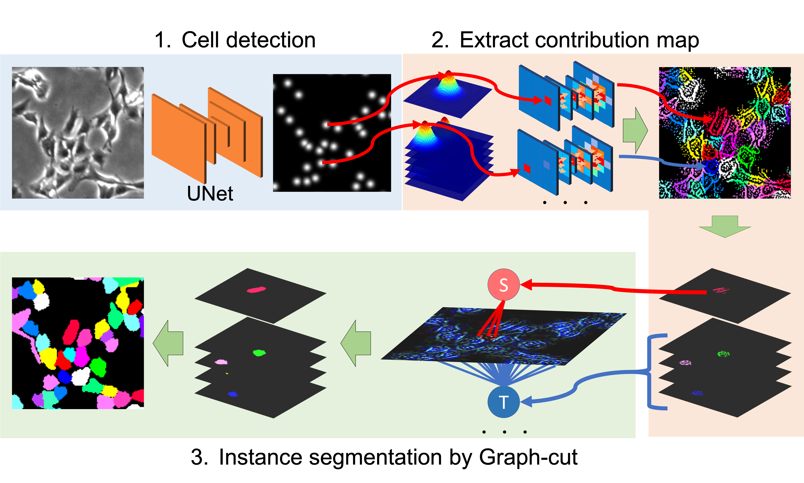

<h2 align="center">Weakly Supervised Cell Instance Segmentation<br>by Propagating from Detection Response</h2>

by Kazuya Nishimura, KER Dai Fei Elmer, Ryoma Bise

[[Home]](http://human.ait.kyushu-u.ac.jp/~bise/researches-bise-CIA.html) [[Project]](https://naivete5656.github.io/WSISPDR/) 
<!-- [[Paper]](https://arxiv.org/pdf/1804.00880)  -->
<!-- [[Supp]](http://yzhou.work/PRM/Supplementary.pdf)  -->
<!-- [[Poster]](http://yzhou.work/PRM/Poster.pdf)  -->
<!-- [[Presentation]](https://www.youtube.com/embed/lNqXyJliVSo?start=4615&end=4850&autoplay=1&controls=0) -->




## Prerequisites
- [python >= 3.6](https://www.python.org)
- [ubuntu 18.04](https://ubuntu.com/)
- CPU or GPU(NVIDIA Driver >= 430)
- [matlab](https://jp.mathworks.com/products/matlab.html)

## Installation

Python setting
### Conda user
```bash
conda env create -f=env_name.yml
conda activate pytorch
```

### Docker user
```besh
docker build ./docker
sh run_docker.sh
```
### Graph-cut installation
Graph-cut setting

We use following code.

https://jp.mathworks.com/matlabcentral/fileexchange/38555-kernel-graph-cut-image-segmentation


```bash
mkdir graphcut 
cd graphcut
wget http://www.wisdom.weizmann.ac.il/~bagon/matlab_code/GCmex1.9.tar.gz
tar -zxvf GCmex1.9.tar.gz
matlab -nodesktop -nosplash -r 'compile_gc; exit'
cd ..
```


## Demo
This demo is only one image's demo.
If you want to apply this method to your dataset, you should prepare the likelihood map.

## Back propagate from each cell
### Use cuda
```bash
python propagate_main.py -g
```
### Use cpu
```bash
python detection_train.py 
```
#### Optins:
-i :input path(str)

-o :output path(str)

-w :weight path want to load

-g :whether use CUDA

## Graph-cut
```bash
matlab -nodesktop -nosplash -r 'graphcut; exit'
```

<div style="color:#0000FF" align="center">
  
</div>

**This is a sample code.**

**We don't provide dataset.**

If you want to apply your dataset, you should prepare the original image and point level annotation(cell centroid).
The attached text file (sample_cell_position.txt) contains a cell position(frame,x,y) as each row.
Prepare the same format text file for your dataset.


## Generate likelyfood map

**Set the variance to a value sufficiently larger than the target object.**
The guided backpropagation depends on variance size.

```bash
python likelymapgen.py 
```

#### Option:
-i :txt_file_path (str)

-o :output_path  (str)

-w :width (int)

-h :height (int)

-g :gaussian variance size (int)


## Train 
### Use cuda
```bash
python detection_train.py -g
```
### Use cpu
```bash
python detection_train.py 
```
#### Optins:
-t :train path(str)

-v :validation path(str)

-w :save path of weight(str)

-g :whether use CUDA

-b :batch size (default is 16)

-e :epochs (default is 500)

-l :learning rate(default is 1e-3)

## Predict
### Use cuda
```bash
python detection_train.py -g
```
### Use cpu
```bash
python detection_train.py 
```
#### Optins:
-i :input path(str) 

-o :output path(str)

-w :weight path want to load

-g :whether use CUDA

## citation

If you find the code useful for your research, please cite:
```bibtex
@inproceedings{nishimura2019weakly,
  title={Weakly Supervised Cell Instance Segmentation by Propagating from Detection Response},
  author={Nishimura, Kazuya and Bise, Ryoma and others},
  booktitle={International Conference on Medical Image Computing and Computer-Assisted Intervention},
  pages={649--657},
  year={2019},
  organization={Springer}
}
```
